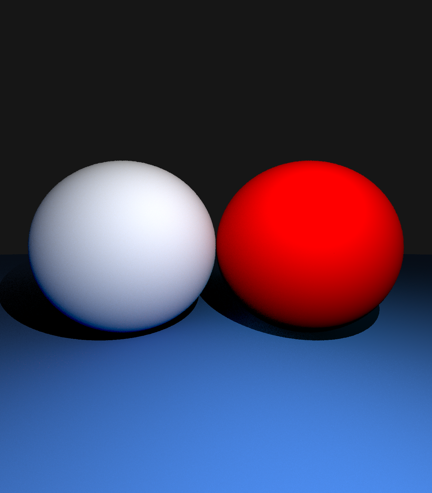
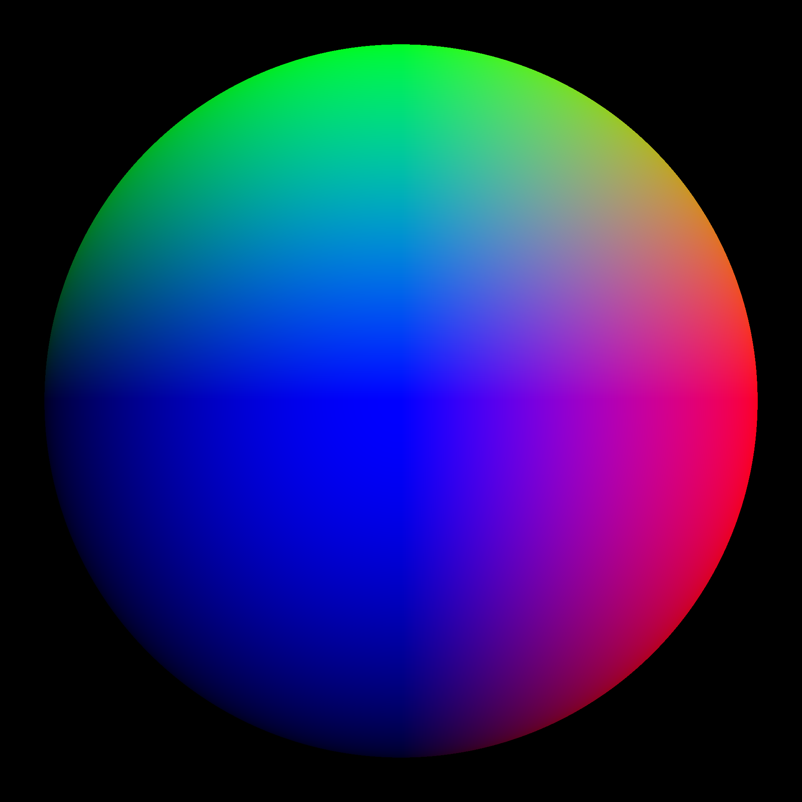
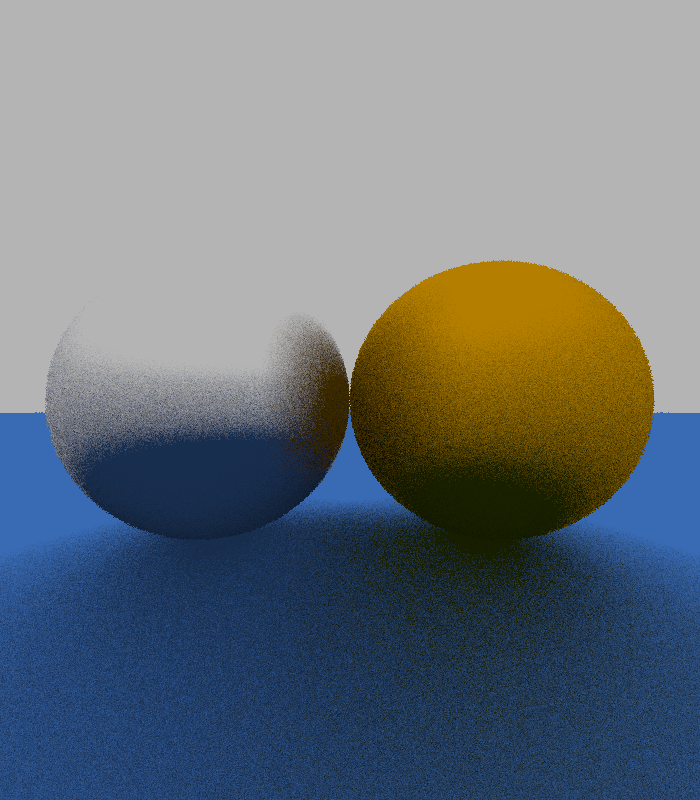
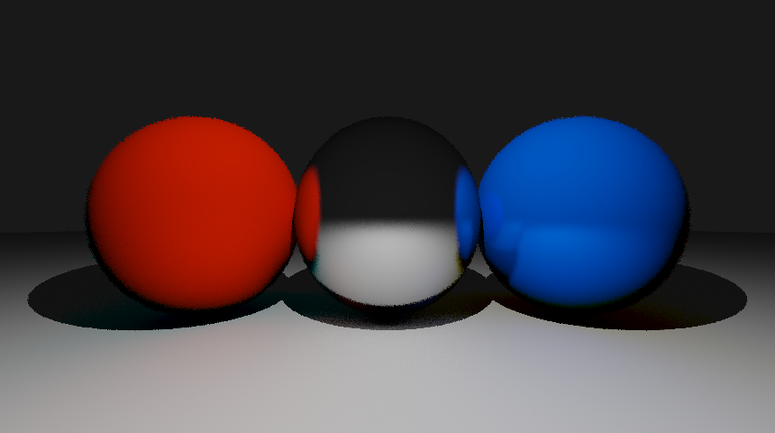

# LiTrace

This is a very simple implementation of a Ray Tracer in C++.

## Dependencies

* [stb_image_write.h](https://github.com/nothings/stb/blob/master/stb_image_write.h)

## Quick Start

```
$ ./build.ps1
$ ./LiTrace
```

## Features

* Diffuse Shading (Lambert)
* Recursive Reflections with unlimited depth (to recursion limit)
* Multiple Objects (_Spheres_)
* Reinhard Tonemapping

| | |
| ------------- | ------------- |
|||
|||
